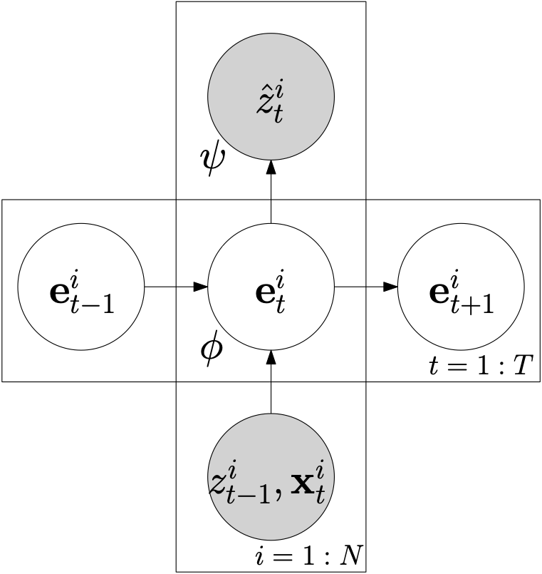

# IE CDT Time Series Analysis and Signal Processing Lab, University of Oxford

## Deep Learning for Time Series Forecasting

### Fernando Moreno-Pino, University of Oxford (fernando.moreno-pino@eng.ox.ac.uk)

This repository implements two different deep learning models for time series forecasting: `DeepAR` ("DeepAR: Probabilistic Forecasting with Autoregressive Recurrent Networks") and `ConvTrans` ("Enhancing the Locality and Breaking the Memory Bottleneck of Transformer on Time Series Forecasting"). 

## A Brief Introduction to Deep Learning for Time Series Forecasting


In this section, we formally state the problem of time series forecasting and introduce a base architecture that represents the core of most deep learning-based autoregressive models in the state-of-the-art. 

### Problem Definition

Given a set of $` N `$ univariate time series $`\{z^{i}_{1:t_0-1}\}_{i=1}^{N} `$, where $` z_{1: t_0-1}^{i} = (z_{1}^{i}, z_{2}^{i}, \ldots, z_{t_{0}-1}^{i}) `$, $` t_0 \in \mathbb{N} `$ is the forecast horizon, $` \tau \in \mathbb{N} `$ is the forecast length, and $` T = t_0 + \tau \in \mathbb{N} `$ is the total length of the sequences, the objective is to model the conditional probability distribution of future trajectories for each time series given the past. Specifically, the goal is to predict the next $` \tau `$ time steps after the forecast horizon:

```math
p\left(z_{t_{0}: t_0 + \tau}^{i} \mid z_{1: t_{0}-1}^{i}, \mathbf{x}_{1: t_0 + \tau}^{i}, \theta\right) = \prod_{t=t_{0}}^{t_0 + \tau} p\left(z_{t}^{i} \mid z_{1: t-1}^{i}, \mathbf{x}_{1: t}^{i}, \theta \right),
```

where $` \theta `$ represents the learnable parameters of the model and $` \{\mathbf{x}^{i}_{1:t_0+\tau}\}_{i=1}^{N} \in \mathbb{R}^{C} `$ are the associated covariates. These covariates, along with the past observations of the time series, serve as inputs to the predictive model.

### Base Architecture

Several state-of-the-art deep-autoregressive models, including DeepAR, ConvTrans, and SAAM, share a high-level architecture, see Figure 1, characterised by the following components:

1. **Embedding Function** $`\mathbf{e}_{t}^{i} = f_{\phi}\left(\mathbf{e}_{t-1}^{i}, z^{i}_{t-1}, \mathbf{x}_{t}^{i} \right) \in \mathbb{R}^{D}`$, where $` f_{\phi}(\cdot) `$ is the transit function with parameters $` \phi `$. At each time step $` t `$, the embedding function takes as input the previous time step's embedding $` \mathbf{e}_{t-1}^{i} `$, the previous value of the time series $` z_{t-1}^{i} `$, and the current covariates $` \mathbf{x}_{t}^{i} `$. This function can be implemented using various architectures such as a RNN, a LSTM, a Temporal Convolutional Network (TCN), or a Transformer model.

2. **Probabilistic Model** $`p\left(z_{t}^{i} \mid \mathbf{e}_{t}^{i} \right)`$, with parameters $` \psi `$, this model utilises the embedding $` \mathbf{e}_{t}^{i} `$ to estimate the next value of the time series $` \hat{z}_{t}^{i} `$. Typically, this probabilistic model is implemented as a neural network function that parameterises the required probability distribution. For instance, a Gaussian distribution can be represented through its mean and standard deviation:

   ```math
   \mu = g_{\mu}(\mathbf{w}_{\mu}^{T} \mathbf{e}_{t}^{i} + b_{\mu}),
   ```
   ```math
   \sigma = \log \left(1 + \exp \left(g_{\sigma}(\mathbf{w}_{\sigma}^{T} \mathbf{e}_{t}^{i} + b_{\sigma})\right)\right),
   ```

   where $` g_{\mu} `$ and $` g_{\sigma} `$ are neural networks.

<div align="left">
  
  <figcaption><strong>Figure 1:</strong> Base architecture of deep learning-based autoregressive
models. Gray represents observed variables.</figcaption>
</div>

### Training

The model's parameters $` \theta = \{\phi, \psi\} `$ are optimised by maximising the log-likelihood function $` \mathcal{L}(\theta) $ over the observed data within the conditioning range (from $` t = 1 $ to $ t_0 - 1 $):

```math
\mathcal{L}(\theta) = \sum_{i=1}^{N} \log p\left(z_{1:t_0-1}^{i} \mid \mathbf{x}_{1:t_0-1}^{i}, \theta\right) = \sum_{i=1}^{N} \sum_{t=1}^{t_0-1} \log p\left(z_{t}^{i} \mid \mathbf{x}_{1:t-1}^{i}, \theta (\phi, \psi) \right).
```

All quantities required for computing the log-likelihood are deterministic, eliminating the need for inference.

### Forecasting

During both training and testing, the conditioning range $` \{1 : t_0 - 1\} `$ acts similarly to the encoder in sequence-to-sequence models, transferring information to the forecasting range $` \{t_0 : t_0 + \tau\} `$, analogous to the decoder. This base framework can thus be interpreted as an encoder-decoder architecture, where both encoder and decoder are the same network.

For forecasting, predictions are made by sampling directly from the model:

```math
\hat{z}^{i}_{t_0:t_0+\tau} \sim p\left(z_{t_{0}: t_{0}+\tau}^{i} \mid z_{1: t_{0}-1}^{i}, \mathbf{x}^{i}_{1:t_0+\tau}, \theta\right),
```

where the model uses the previous time step's prediction $` \hat{z}_{t-1}^{i} `$ as input, unlike the conditioning range where $` z_{t-1}^{i} `$ is observed. This is shown in Figure 2.

Note that Transformers, unlike RNNs or LSTMs, do not compute the embedding in a sequential manner. Accordingly, when obtaining the embedding through a Transformer model and so to use the encoder-decoder architecture previously described, we use the Transformer decoder-only mode.

<div align="left">
  
  <figcaption><strong>Figure 2:</strong> Unrolled base architecture. On the left of the forecast horizon, the conditioning range can be found. On its right, the forecasting range.</figcaption>
</div>


### Metrics and Evaluation

Common metrics used for forecasting evaluation are the Normalized Deviation (ND) and Root Mean Square Error (RMSE):

```math
	\begin{split}
	\mathrm{ND} &=\frac{\sum_{i, t}\left|z_{i, t}-\hat{z}_{i, t}\right|}{\sum_{i, t}\left|z_{i, t}\right|} \\[5pt]
	\text { RMSE } &=\frac{\sqrt{\frac{1}{N\left(T-t_{0}\right)} \sum_{i, t}\left(z_{i, t}-\hat{z}_{i, t}\right)^{2}}}{\frac{1}{N\left(T-t_{0}\right)} \sum_{i, t}\left|z_{i, t}\right|}\\[5pt]
	\end{split}
```

Also, the quantile loss, $`QL_{\rho}`$, with $`\rho \in (0, 1)`$ are commonly used:

```math
	\begin{split}
	\mathrm{QL}_{\rho}(z, \hat{z})&=2 \frac{\sum_{i, t} P_{\rho}\left(z_{t}^{(i)}, \hat{z}_{t}^{(i)}\right)}{\sum_{i, t}\left|z_{t}^{(i)}\right|},\\
	\quad P_{\rho}(z, \hat{z})&=\left\{\begin{array}{ll}
	\rho(z-\hat{z}) & \text { if } z>\hat{z}, \\
	(1-\rho)(\hat{z}-z) & \text { otherwise }.
	\end{array}\right.
	\end{split}
```

### References

- Salinas, D., Flunkert, V., Gasthaus, J., & Januschowski, T. (2020). DeepAR: Probabilistic forecasting with autoregressive recurrent networks. International journal of forecasting, 36(3), 1181-1191.
- Li, S., Jin, X., Xuan, Y., Zhou, X., Chen, W., Wang, Y. X., & Yan, X. (2019). Enhancing the locality and breaking the memory bottleneck of transformer on time series forecasting. Advances in neural information processing systems, 32.
- Moreno-Pino, F., Olmos, P. M., & Artés-Rodríguez, A. (2023). Deep autoregressive models with spectral attention. Pattern Recognition, 133, 109014.


## Creating Conda Environment

The repo contains a `dlts.yml` file, a conda environment that allows running both models both models. To install it:

```
conda env create -f dlts.yml
```

Alternatively, you can create a new conda environment with Python 3.10 (version used for testing) and install the rest of the packages (see requirements.txt).

```
conda create --name name-of-env python=3.10
```

(Note: it is recommended to run the code in VS Code).

## DeepAR: Probabilistic Forecasting with Autoregressive Recurrent Networks

- Paper: https://arxiv.org/abs/1704.04110.

- Code from: https://github.com/husnejahan/DeepAR-pytorch.

### Instructions to run DeepAR


1. Download the electricity dataset: https://archive.ics.uci.edu/ml/datasets/ElectricityLoadDiagrams20112014.
2. Move it into the `/DeepAR/` folder and run:
```
python preprocess_elect.py
```
3. Run the main file: `python main.py`

**Note:** Once you have downloaded the data, instead of directly running the `main.py` source code, you can explore the notebook `/DeepAR/DeepAR_intro.ipynb`, which introduces some of the most important functions of DeepAR.

4. Results will be saved in `/DeepAR/experiments/base_model/`.

Note that, if training is taking too much time, you can use the option `max_samples` when setting up the `WeightedSampler` for training only on a subset of time series (but take into account that you probably won't converge to a proper solution and performance on test will drop) with the following line:

```
sampler = WeightedSampler(data_dir, args.dataset, replacement=True, max_samples=5000)
```

## Enhancing the Locality and Breaking the Memory Bottleneck of Transformer on Time Series Forecasting

- Paper: https://arxiv.org/abs/1907.00235.

### Instructions to run ConvTrans


1. Run the main file: `python main.py`. (You may need to adjust the directory paths in the code).

If training is taking too much time, you can set the argument `train-ins-num` to a lower number for training only on a subset of time series (but take into account that you probably won't converge to a proper solution and performance on test will drop)

The model will show the results in the command line. 

